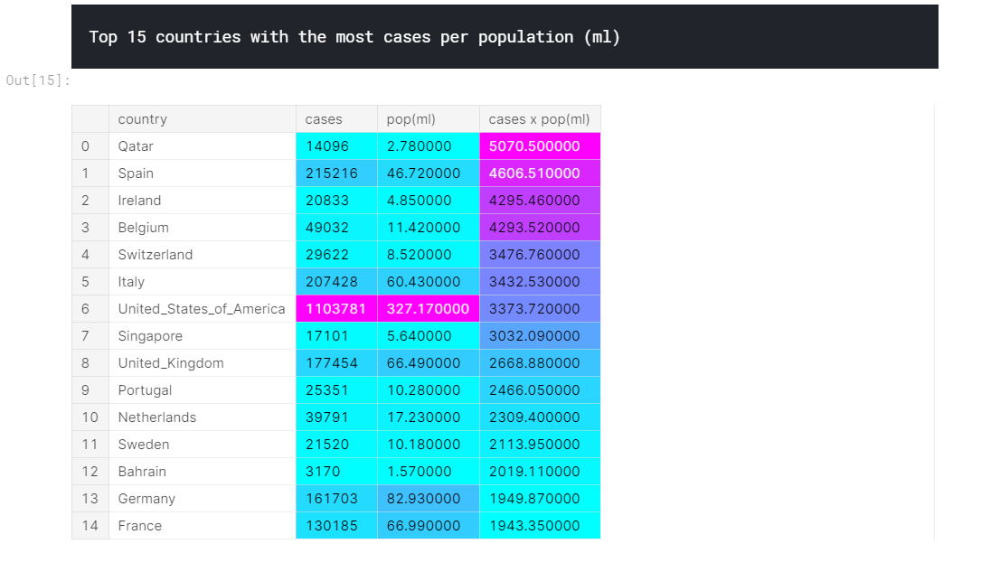
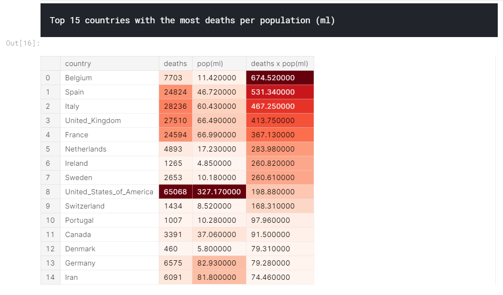
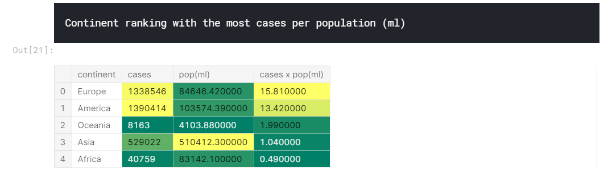
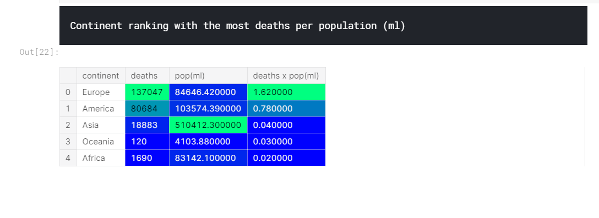
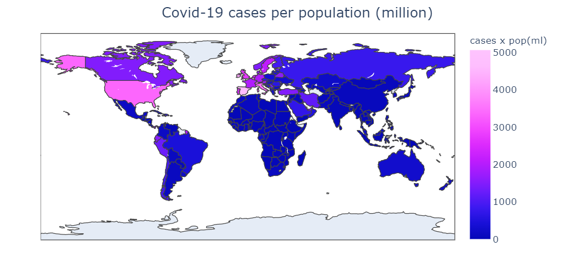
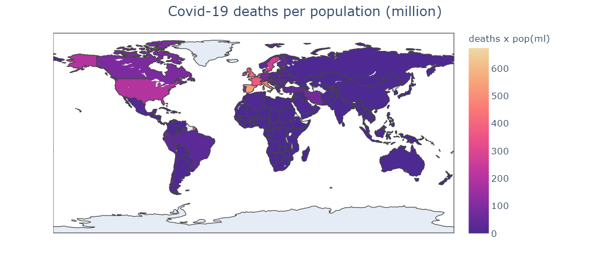
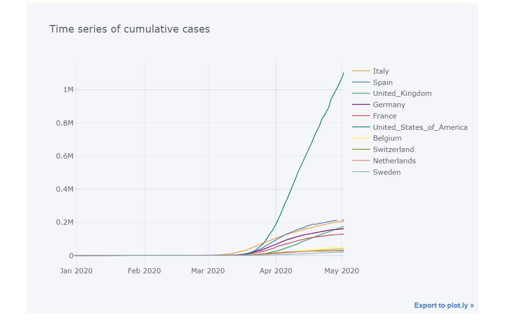
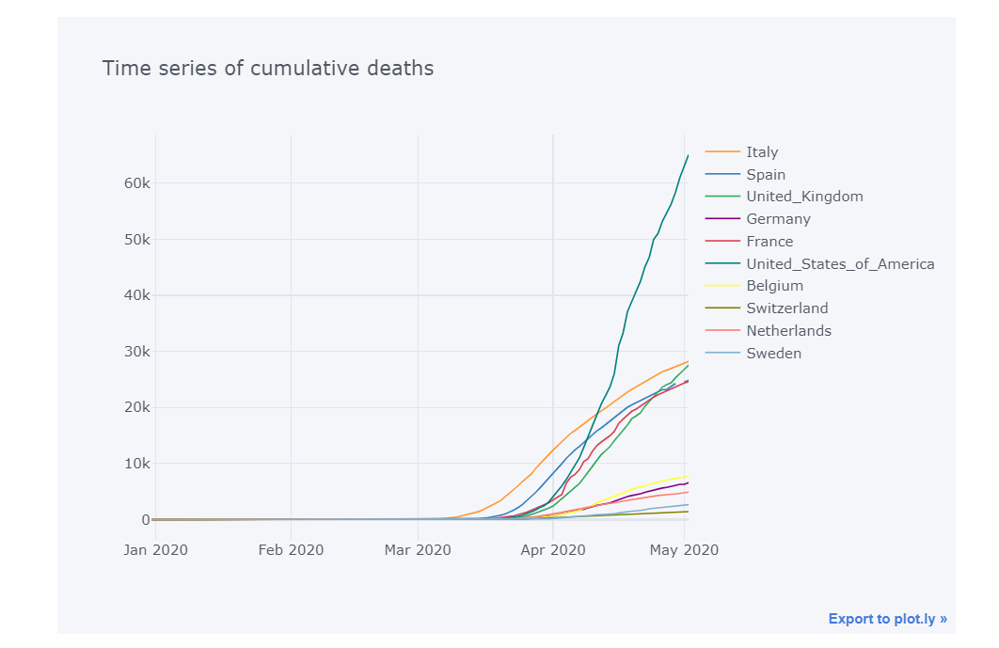
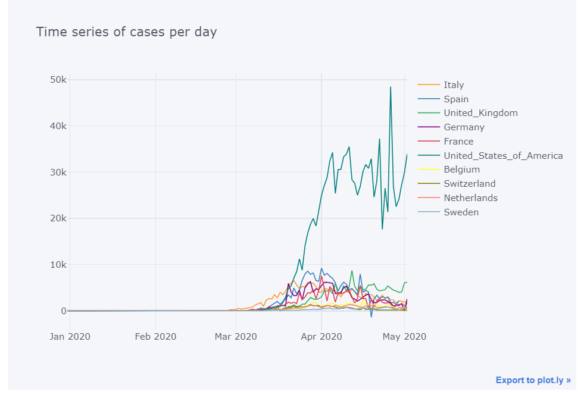
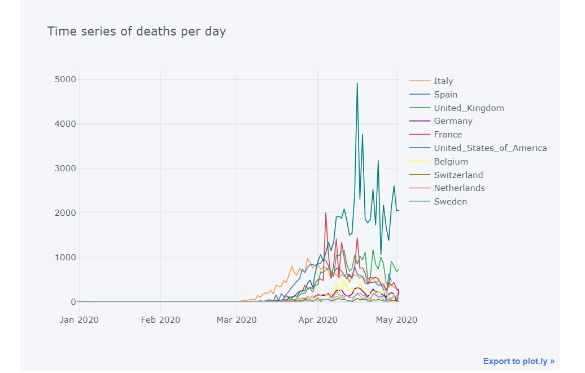

# COVID-19 WORLDWIDE ANALYSIS

The followed analysis has used a data set provided by the European Union updated on 2 May 2020. Data are availabe at this link: https://www.ecdc.europa.eu/en/publications-data/download-todays-data-geographic-distribution-covid-19-cases-worldwide 
The file is updated daily and contains the latest available public data on COVID-19. Each row/entry contains the number of new cases and deaths reported per day and per country

Below plot results from the Covid-19 analysis

